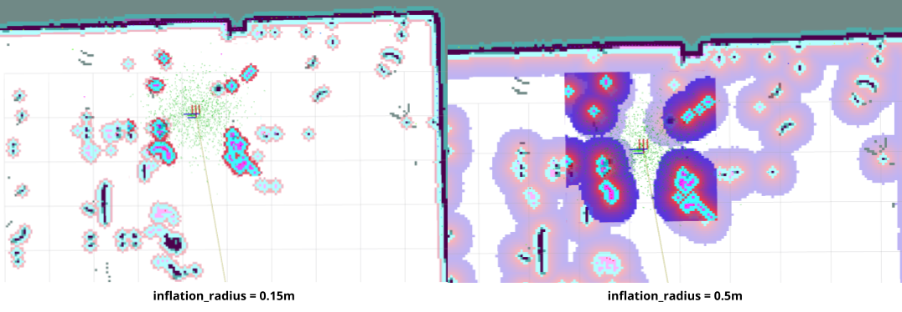
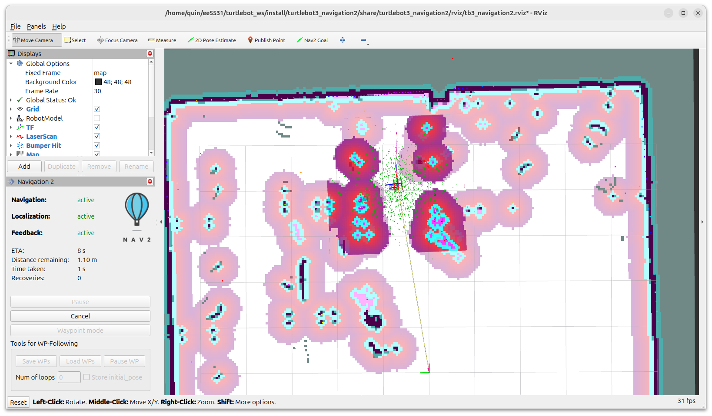
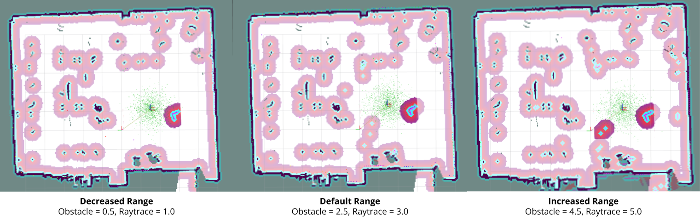
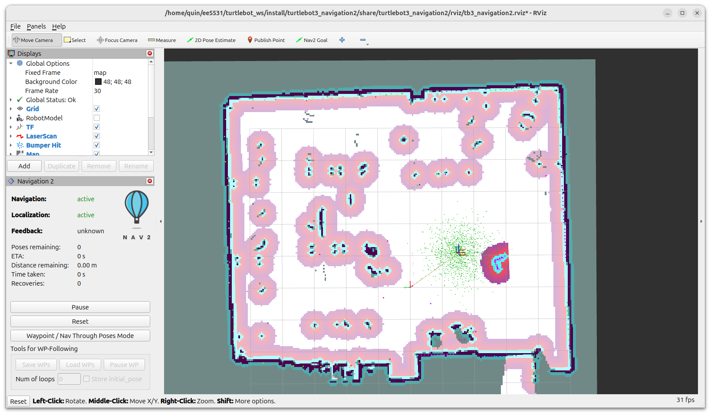
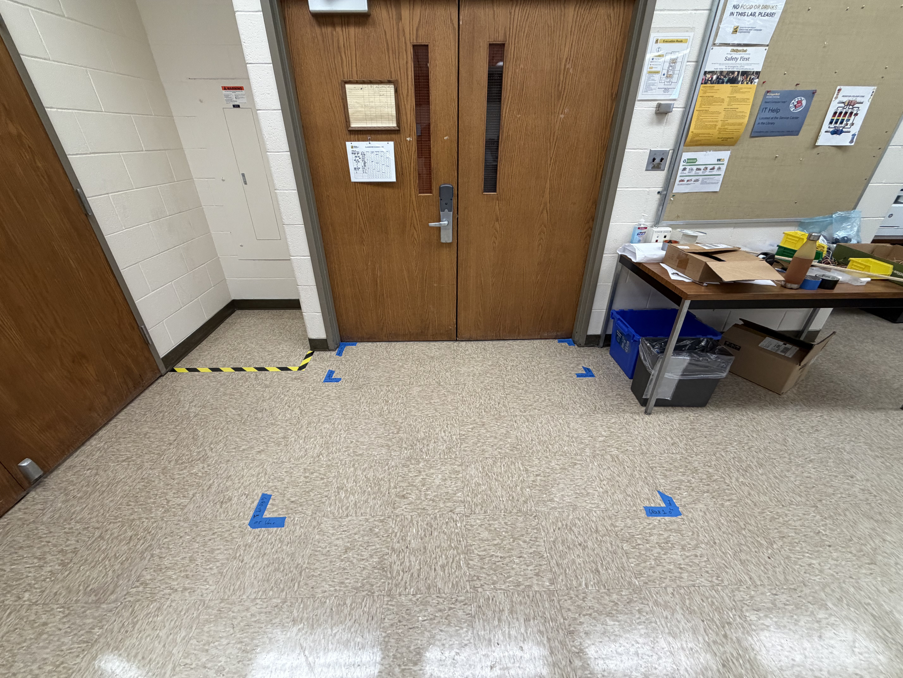
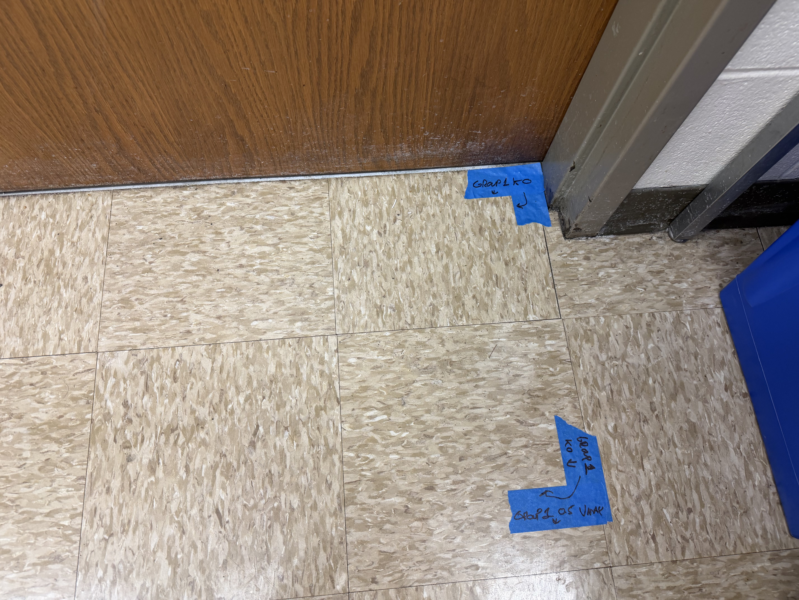
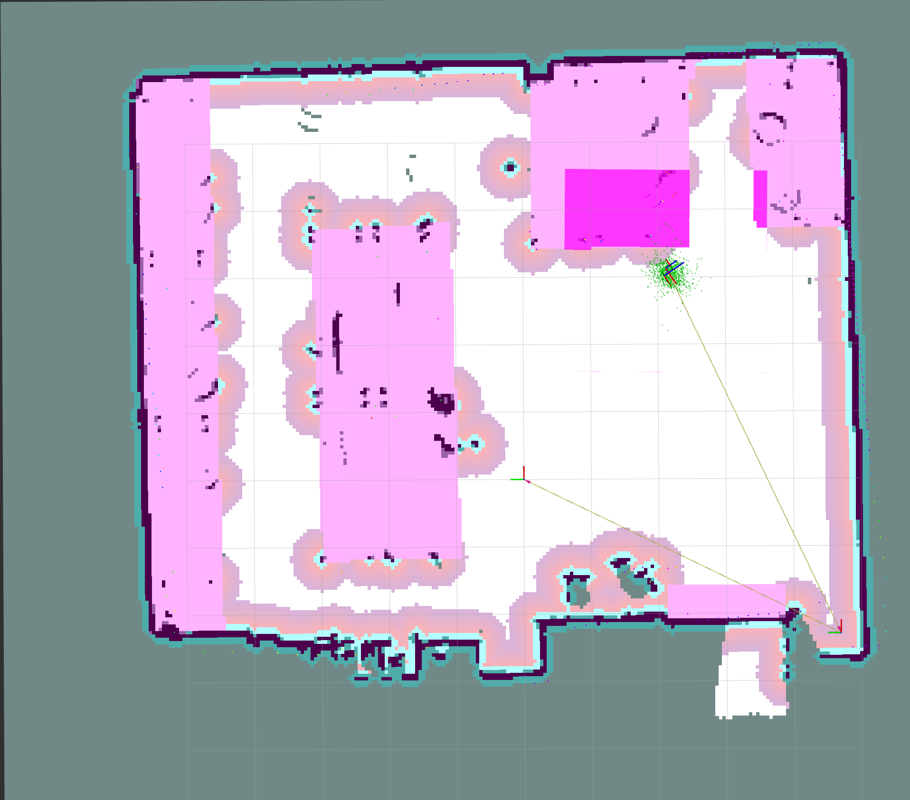

# Project 8: Costmap Configuration and Autonomous Patrol
Reid Beckes, Jackson Newell, Ian Mattson, and Anders Smitterberg


# Introduction + Setup

In this project, the Turtlebot3 will serve as a Patrol Robot by using the Nav2 stack to autonomously navigate to a series of waypoints in the EERC 722 lab. Parameter tuning and map modifications to include keepout zones and reduced speed zones are used together to demonstrate the Nav2's planning and localization skills in complex enviornments.

This project is completed and tested in ROS2 Jazzy Jalisco on an Ubuntu 24.04 Noble Numbat PC.

Each Turtlebot3 in EERC 722 is assigned a static IP on a lab managed wireless router. Our group used Turtlebot Anchovy, which is assigned local IP address 32.80.100.108 and `ROS_DOMAIN_ID=8`. 

The testing enviornment is setup on a local PC by exporting the following parameter flags:
```bash
$ export ROS_DOMAIN_ID=8
$ export TURTLEBOT3_MODEL=burger
$ export RMW_IMPLEMENTATION=rmw_fastrtps_cpp
```

The Turtlebot3 modified Nav2 parameters are located here: [`/config/nav2_params.yaml`](./config/nav2_params.yaml).  Further instructions on launching the Turtlebot3 Nav2 node are in the Usage Instructions section.

### - Any setup challenges and how you resolved them (update before submission) !!! FACT CHECK PLEASE (i was unsure of what the problem with nav2 was)

Setting up to run the final test case had a couple challenges pop up. One main was the difference between Nav2 Parameters and Turtlebot3 Nav2 Parameters. There are different parameters for each, so the Nav2 yaml file had to be altered to fit what was being used. However, the Nav2 Parameters were made to work with the Turtlebot so the issue was resolved. Another challenge was with the speed zones. There was very strange behavior with the speed zones as the Turtlebot would stop in the middle of one of them. After looking at the issue for a while, the speed zone mask was altered to remove that speed zone and the patrol began to work fine. The ultimate cause for this issue was never found.


# Part 1 - Costmap Configuration

This initial section focuses on tuning costmap parameters in the Nav2 stack to adjust how the robot plans and executes paths.  Obstacle inflation radius and cost scaling factor are consideres, as well as obstacle max range and raytrace max range.

## Baseline Parameters

The Turtlebot's Nav2 package uses the following parameters as a baseline inflation radius and cost scaling factor in both the local and global costmaps:

| Baseline Default Params | `inflation_radius` | `cost_scaling_factor` | 
| :--: | :--: | :--:|
| local costmap | 0.5 | 5.0 |
| global costmap | 0.5 | 5.0 |


## Parameter Tuning

Using the initial parameters as a baseline, variations of the two parameters were tested by launching the Turtlebot Nav2 stack and setting a 2D pose estimate before sending a Nav2 goal pose through a narrow coordidor. The following permutations were tested for the local and global costmap parameters with the noted results:

| `inflation_radius` | `cost_scaling_factor` | Observed Effect |
| :---------: | :---------: | :---------: |
|  0.50  |  5.0  | __[Baseline]__ Collision with object  |
|  0.15  |  2.0  |  Success, meandered  |
|  0.30  |  2.0  |  Collision with object  |
|  0.45  |  2.0  |  Success, very straight path  |
|  0.15  |  3.5  |  Success, meandered and very close collision |
|  0.30  |  3.5  |  Collision with object  |
|  0.45  |  3.5  |  Collision with object  |
|  0.15  |  5.0  |  Success, meandered and very close collision  |
|  0.30  |  5.0  |  Success, meandered and very close collision  |
|  0.45  |  5.0  |  Collision with object  |

In all cases, the robot was initially placed approximately 1m away from a waypoint surrounded by obstacles on three sides, with at least 0.6m clearance on all sides of the goal point. 

Despite a seemingly clear route from the starting pose to the goal pose in the coordidor, the robot seemed to want to veer off into the obstacles or at least get closer to them.  This caused many parameter variations to fail due to collisions with the obstacle.  The basis for this veering appears to be the result of detection variance around the objects, as the Turtlebot has previously had difficulty detecting the chairs used as part of the corridor.

Smaller inflation radius parameter sets resulted in more flexible path planning, as the robot had significantly more "clear" space to traverse.  High inflation radius values constrained the path to a clear "single route only" path to avoid the high cost of obstacles, illustrated in the side-by-side RViz costmap comparison in Figure 1.




Figure 1: Smallest and largest tested inflation radius costmaps in RViz

## Parameter Tradeoff

While a smaller inflation radius provides more low-cost, navigable space for the robot in EERC 722, risk of collisions increase due to the number of obstacles with unusual geometry that may not be represented accurately from the robot's laserscan.  Namely, the chairs and bench legs in EERC 722 pose significant obstacles to the robot, as these obstacles appear as small posts or "legs" at the height of the laser scanner, but actually have much wider geometry than which is represented in the costmap.  Therefore, a larger inflation radius helps the robot plan around the obstacles with a sufficently wide margin of error.  We have preliminarly chosen 0.45m as our inflation radius.

Since the inflation radius is quite large, a lower cost scaling factor is also selected such that there is not a prohibately high cost should the robot *have* to plan through tight areas.  We have selected a cost scaling factor of 2.0.  Figure 2 demonstrates the Turtlebot navigating with the parameters along the planned path to the goal pose.




Figure 2: Turtlebot navigating along the planned path to the goal pose using the tuned `inflation_radius` and `cost_scaling_factor` parameters.


# Obstacle Layer

The obstacle range min/max and raytrace range min/max parameters are used in the Nav2 stack to set the range limits for detecting objects and clearing objects from the map. Three sets of parameters were considered: The default range, one set closer than the default range, and one farther than the default range, summarized below. A visual comparison is also shown in Figure 3.

| Param Set | Obstacle Max Range | Raytrace Max Range | 
| :--: | :--: | :--: | 
| Default | 2.5 | 3.0 |
| Decreased | 0.5 | 1.0 |
| Increased | 4.5 | 5.0 |




Figure 3: Comparison of decreased, default, and increased `obstacle_max_range` and `raytrace_max_range` parameters. As the range increases, noise in the map becomes more pronounced.

Figure 4 shows the tuned, decreased range parameters detecting a box near the robot, illustrating the shape of the object, the inflation layer and cost scaling, and where the raytrace parameter clears the box from the map behind the box, where a sharp, straight line is the "raytrace threshold".



Figure 4: Real-time object detection with an `obstacle_max_range` of 0.5 m and a `raytrace_max_range` of 1.0 m


# Part 2 - Keepout and Speed Filter Zones

## Physical Floor Markers

Blue tape marks both filter zones in front of the main door of EERC 722. The zone closest to the door (0–50 cm out) is the **keepout zone** chosen because someone opening the door may not see the robot and could step or trip on it. The band from 50–150 cm is the **speed restriction zone** (≤ 50% max speed), providing a safe buffer before the keepout area. both areas are the width of the door. This also has the benefit of making is very easy to draw the boundaries in software. Additionally, the tables were designated to be keepout zones, excepting one set of tables, where the robot can safely navigate under, making patrol easier.

| Zone | Distance from door |
|------|--------------------|
| Keepout | 0 – 50 cm |
| Speed restriction | 50 – 150 cm |

### Overview — full keepout + speed zone extent



### Keepout zone boundary (0–50 cm from door)



### Speed zone outer boundary (150 cm from door)


### Keepout zone in costmap (RViz2)


### Keepout zone demonstration — robot routes around zone


### Speed restriction zone demonstration — robot slows on entry


The door keepout zones were chosen to be both practical and easy to identify on the map. The keepout and speed zones were defined relative to the door frame, which was clearly visible in the map.

To determine the correct size and placement of the zones in GIMP, we followed these steps:
1. Measured the real-world width of the door in centimeters.
2. Opened the map image in GIMP and used the measure tool to find the number of pixels corresponding to the door opening width.
3. Calculated the pixels-per-meter ratio (pixels measured / real-world meters).
4. Created a new layer and, using the rectangle select tool, drew the keepout zone extending 50 cm (using the calculated pixel length) from the door.
5. Repeated the process on another layer for the speed reduction zone (50–150 cm from the door).
6. For table keepout zones, identified table locations and drew rectangles over them on the appropriate layers.
7. Selected all black pixels in each layer, inverted the selection, and filled the rest with white to ensure proper mask formatting.
8. Exported each layer as a separate image file for use as a costmap filter.

I did not need to determine coordinates using this method, as all the zones could be drawn relative to known features.

# Part 3 - Patrol Script
- Waypoint table: ID, map-frame coordinates, brief description of location
- Description of your loop closure check implementation
- Terminal output from a patrol run (copy-paste the log)


## Terminal Output

The log from the patrol script can be viewed in the final patrol run video in part 4. It is on the left side of the screen in the bottom right terminal. The log is lengthy with updates at each step so it would clutter this file. 

# Part 4 - Patrol Execution and Analysis
- Link to patrol video (or embedded if commited directly)
- Recovery event description (what happened, Nav2's response, your mitigation)
- Comparison to Project 3 dead-reckoning drift

## Recovery Event

During the final patrol run recorded, it can be seen in the last cycle that an object is put in its way from waypoint three to the starting waypoint, waypoint four. Initially it seems like the turtlebot is going to go around it already, but as it approaches the object, the turtlebot stops. The obstacle was processed and the inflation of the object made the turtlebot stop, enter recovery, and reroute. The behavior is somewhat odd, but is still able to route to the final point to complete the cycle. So, the waypoint didn't fail and was able to recover. The recovery event though, seemed to be caused by the obstacle radius being too close to the robot. If the turtlebot was able to sense the object in its path before it had gotten to close, then, its path to the final waypoint could have been smoother and cleared the obstacle completely.


## Drift Analysis

| Cycle | Start Pose (x,y) | End Pose (x,y) | Drift (m) |
| :--: | :--: | :--: | :--: |
| 1 |  (2.65, -4.11)  |  (2.76, -4.10)  |  0.11 m  |
| 2 |  (2.76, -4.10)  |  (2.77, -4.10)  |  0.12 m  |
| 3 |  (2.77, -4.10)  |  (2.71, -4.08)  |  0.06 m  |

The table above showcases the drift exhibited in the final patrol case. The drift is calculated with respect to the original starting distance of cycle one. After cycle one the drift goes to 0.11 m away from the starting point, then after the second cycle it is slightly worse at 0.12 m. However, at the end of the third and final cycle, the drift is 0.06 m from the original starting point. Therefore, the drift across cycles is not consistent. The first and second cycles are consistent with their drifts, but then it is reduced in the third. With this in mind, the AMCL does seem to recorrect itself as the cycles happen. Some reasons behind this include loop closures improving the localization and checking landmarks in that loop multiple times. This drift compared to Project 3's drift is much improved. The drift in Project 3 using the IMU was horrible due to noise and other factors. The pose estimation using the cmd_vel was solid within the scope of Project 3 and is comparable to this project's drift. However, if the system used in Project 3 was used for this project, then the drift would probably be over a meter.

# Usage Instructions

All commands are run from the workspace root (`proj8_ws/`). Source the workspace and set the robot model before running anything:

```bash
export TURTLEBOT3_MODEL=burger
export ROS_DOMAIN_ID=8
source install/setup.bash
```

### Terminal 1 — TurtleBot3 bringup (SSH into robot, run on the robot)
```bash
ros2 launch turtlebot3_bringup robot.launch.py
```

### Terminal 2 — Costmap filter servers (workstation)
```bash
ros2 launch src/config/filters_launch.py
```
Wait until you see `Managed nodes are active` before proceeding.

### Terminal 3 — Nav2 (workstation)
```bash
ros2 launch turtlebot3_navigation2 navigation2.launch.py \
  use_sim_time:=False \
  map:=src/maps/eerc722.yaml \
  params_file:=src/config/nav2_params.yaml
```

Once Nav2 is up, use RViz2's **2D Pose Estimate** to initialize AMCL before sending any navigation goals.

### Terminal 4 — Patrol script
```bash
ros2 run patrol patrol_node.py --cycles 3
```

# AI Disclosure

**Anders Smitterberg** used Generative AI to assist with Part 2 of this project in the following areas:

**1. Debugging filter servers not appearing in the Nav2 costmap**
- *Prompt:* Provided terminal output (`ros2 topic list`, Nav2 launch logs) and asked GenAI to diagnose why the keepout and speed filter zones were not visible in RViz2.
- *Verification:* Claude identified the `docking_server` was crashing on startup due to a `cmd_vel` topic type mismatch (`Twist` vs `TwistStamped`), causing `lifecycle_manager_navigation` to abort bringup entirely. Both diagnoses were confirmed by inspecting `ros2 topic info` subscriber counts and the Nav2 terminal error logs. The fix (`enable_stamped_cmd_vel: true` in `docking_server` params) was verified by relaunching Nav2 and confirming subscriber count rose to 2.

**2. README formatting**
- *Prompt:* Asked GenAI to format the Usage Instructions section of the README with correct launch commands for Part 2.
- *Verification:* Commands were reviewed and tested on the real robot.

**Ian Mattson** did not use any GenAI for this project.

